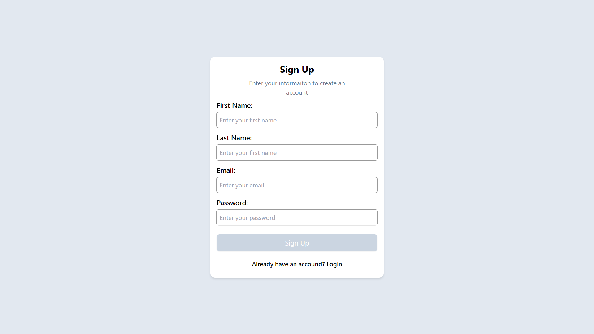
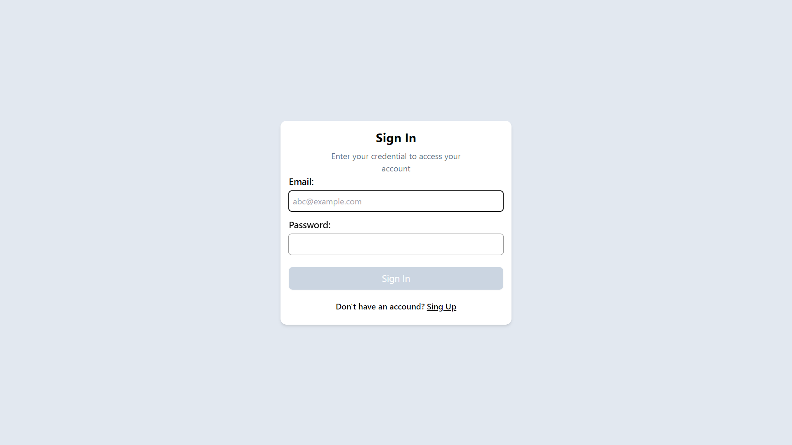
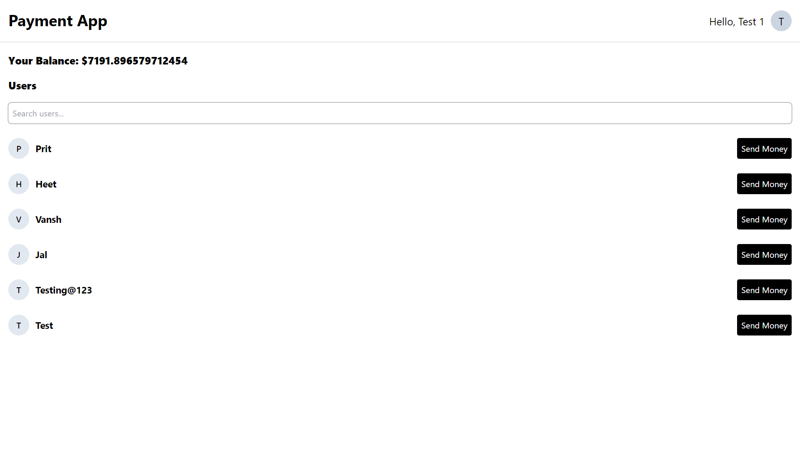
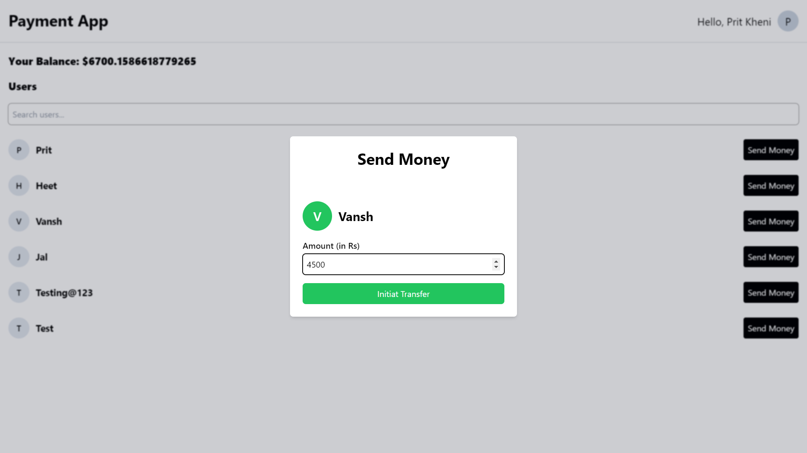

# Paytm-Like App Learning Project

This project is designed for learning purposes to gain a better understanding of web development technologies such as React, React Router DOM, Context API, Recoil, Node.js, Express.js, Zod validation, and middleware.

## Getting Started

### Prerequisites

Make sure you have the following installed on your machine:

- [Node.js](https://nodejs.org/)
- [Git](https://git-scm.com/)

### Installation

1. Clone the repository:

   ```bash
   git clone https://github.com/your-username/paytm-like-app.git
   cd paytm-like-app
   ```

2. Install dependencies for both the frontend and backend:

   ```bash
   # Install frontend dependencies
   cd frontend
   npm install

   # Install backend dependencies
   cd ../backend
   npm install
   ```

### Running the Application

1. Start the backend server:

   ```bash
   # Navigate to the server directory
   cd ../backend

   # Run the server
   npm start
   ```

2. Start the frontend development server:

   ```bash
   # Navigate to the client directory
   cd ../frontend

   # Run the frontend
   npm run dev
   ```

Visit [http://localhost:5173](http://localhost:5173/) in your browser to access the Paytm-like app.

## Project Structure

The project is structured into two main parts:

- **client**: Frontend built with React.
- **server**: Backend built with Node.js and Express.js.

### Frontend Structure

The frontend structure follows a modular approach, with components organized under the `src/components` directory. Key concepts covered in the frontend include:

- React Router DOM for navigation.
- Context API for state management.
- Recoil for additional state management.

### Backend Structure

The backend is structured to handle routes, validation, middleware, and more. Key concepts covered in the backend include:

- Node.js and Express.js for server development.
- Zod for validation of incoming data.
- Middleware for enhancing server functionality.
  -Jwt for login authentication.

## Screenshots






## Learn and Contribute

Feel free to explore, learn, and contribute to this project. Experiment with different features, expand functionalities, or integrate additional technologies to further enhance your skills.

If you encounter issues, have suggestions, or want to contribute, please open an issue or create a pull request.

Happy coding! 🚀
